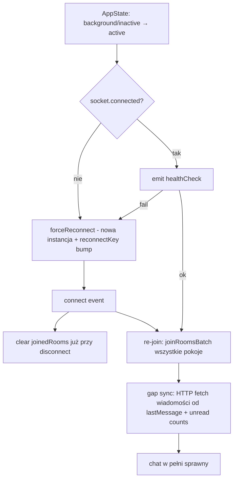

# RAPORT — Odzyskiwanie połączenia po utracie focusu i bezpieczne zrywanie połączeń w tle

Data: 2026-07-23
Zakres: `context/SocketIoContext.jsx`, `context/socketStore.js`, `components/NetworkGuard.jsx`, `context/NotificationContext.jsx`

---

## 1. Stan faktyczny (kod vs. CLAUDE.md)

`CLAUDE.md` jest nieaktualny — część "Known Bugs" opisuje problemy, na które w kodzie
istnieją już **częściowe** poprawki:

| Mechanizm                                                                  | Stan w kodzie                                                             | Plik / linie                     |
| -------------------------------------------------------------------------- | ------------------------------------------------------------------------- | -------------------------------- |
| AppState listener → reconnect po powrocie z tła                            | ✅ JEST (wbrew MD "nikt nie tworzył żadnego checku")                      | `SocketIoContext.jsx` L276–305   |
| `forceReconnect()` — pełny reset socketów + `reconnectKey` bump            | ✅ JEST                                                                   | `socketStore.js` L341–369        |
| `healthCheck` emit po `connect` i po resume                                | ✅ JEST                                                                   | `SocketIoContext.jsx` L175, L295 |
| Re-join pokoi po reconnect (effect na `chatConnectionState === CONNECTED`) | ✅ JEST (batch join wszystkich pokoi, niezależnie od cache `joinedRooms`) | `SocketIoContext.jsx` L314–373   |
| `roomsRestored` — serwer odtwarza członkostwo pokoi                        | ✅ nasłuch JEST po stronie klienta                                        | `SocketIoContext.jsx` L193–195   |
| Czyszczenie `joinedRooms` przy `disconnect`                                | ❌ BRAK — luka (patrz §2.1)                                               | —                                |
| Obsługa `reconnect_failed` (wyczerpanie 10 prób)                           | ❌ BRAK (patrz §2.2)                                                      | —                                |
| Świadome rozłączanie socketów przy minimalizacji                           | ❌ BRAK (patrz §4)                                                        | —                                |
| Dosync wiadomości pominiętych w tle (gap sync)                             | ❌ BRAK (patrz §2.4)                                                      | —                                |
| Ping serwera w NetworkGuard                                                | 🔧 **WYŁĄCZONY w tej zmianie** (`SERVER_PING_ENABLED = false`)            | `NetworkGuard.jsx`               |

**Wniosek:** scenariusz "wróciłem z tła → sockety martwe" jest już częściowo obsłużony.
Problemy, które nadal występują, wynikają z luk opisanych niżej — nie z całkowitego braku mechanizmu.

---

## 2. Zidentyfikowane luki (dlaczego chat nadal potrafi "umrzeć")

### 2.1. `joinedRooms` nie jest czyszczony przy `disconnect` — ★ najbardziej prawdopodobna przyczyna

Socket.IO przy **auto-reconnect** używa tej samej instancji socketa, ale serwer widzi
**nowe** połączenie (nowy `socket.id`) — członkostwo pokoi po stronie serwera przepada.
Klientowy cache `joinedRooms` (Set w `socketStore.js` L35) **nie jest czyszczony** na
`disconnect`, więc:

- `joinRoom(roomId)` (L154–169) zwraca `{ alreadyJoined: true }` **bez emitowania `joinRoom`**,
- użytkownik może _wysyłać_ wiadomości (emit działa), ale _nie odbiera_ nowych (serwer nie ma go w roomie),
- objaw dokładnie zgadza się z bugiem "chat unresponsive po minimalizacji".

Batch re-join z efektu (L314–373) częściowo to maskuje (emituje wszystkie `roomIds` wprost,
bez filtra po cache), ale odpala się tylko gdy `chatConnectionState` przejdzie
`RECONNECTING → CONNECTED` **i** React zdąży przerenderować. Wyścig: jeśli użytkownik wejdzie
do pokoju zanim batch dojedzie, `joinRoom` skróci obieg przez stale cache.

**Fix (mały, bezpieczny):** w handlerze `disconnect` obu socketów wyczyścić cache:

```js
newChatSocket.on('disconnect', (reason) => {
  _getJoinedRooms().clear()   // ← serwer i tak zapomniał o pokojach
  ...
})
```

### 2.2. `reconnectionAttempts: 10` + brak obsługi `reconnect_failed`

Konfiguracja (`SocketIoContext.jsx` L47–59): 10 prób, backoff do 30 s. Przy dłuższym braku
sieci **w foregroundzie** (np. tunel, winda, słaby zasięg) socket wyczerpuje próby i
**przestaje próbować na zawsze** — a zdarzenie `reconnect_failed` nie jest obsłużone.
AppState listener nie pomoże, bo apka nie była w tle.

**Fix — dwie opcje:**

- `reconnectionAttempts: Infinity` (najprościej; backoff 30 s i tak ogranicza ruch), **lub**
- nasłuch `io.on('reconnect_failed')` → `forceReconnect()`.

Dodatkowo: teraz gdy ping w NetworkGuard jest wyłączony, warto spiąć powrót sieci z socketami —
`Network.addNetworkStateListener` → gdy urządzenie wraca online i socket nie jest `connected`,
wywołać `forceReconnect()` (można to dodać w `SocketIoContext.jsx`, nie w NetworkGuard).

### 2.3. Wyścig `forceReconnect` vs. trwający auto-reconnect

Po resume, gdy socket jest w trakcie własnego auto-reconnectu, `forceReconnect()` tworzy
**nową** instancję, a stara (po `disconnect()`) jest porzucana. Jeśli jakiś konsument trzyma
referencję do starej instancji (zamiast czytać przez `useSocketStore.getState().chatSocket`),
dostaje martwy obiekt. Warto zaudytować, czy wszystkie akcje idą przez store (akcje w
`socketStore.js` są OK — używają `get()`), oraz czy żaden ekran nie łapie `chatSocket`
do lokalnego `useRef`.

### 2.4. Brak dosyncu wiadomości po powrocie z tła (gap sync)

Nawet po poprawnym re-join, wiadomości wysłane **w czasie gdy apka była w tle** nie zostaną
dostarczone (socket ich nie odbierał). Obecnie nic ich nie dociąga. Potrzebny mechanizm:
po `connect` (re-connect) i po powrocie z tła → HTTP fetch wiadomości od ostatniego znanego
`timestamp`/`lastMessage._id` dla aktywnego pokoju + odświeżenie `unreadCount` list pokoi
(efekt `getRoomsWithUnreadCounts` już to robi dla list — brakuje tego dla otwartego ekranu czatu).

---

## 3. Rekomendowany przepływ odzyskiwania połączenia (docelowy)



Kolejność wdrażania (od najtańszego do najbardziej inwazyjnego):

1. **`joinedRooms.clear()` w handlerze `disconnect`** — 2 linie, usuwa główny wyścig (§2.1).
2. **`reconnectionAttempts: Infinity`** lub handler `reconnect_failed` (§2.2).
3. **Listener `Network.addNetworkStateListener` w SocketIoContext** — sieć wróciła → sprawdź
   sockety → ewentualny `forceReconnect()` (zastępuje rolę wyłączonego pinga).
4. **Gap sync na ekranie czatu** — refetch wiadomości po `chatConnectionState → CONNECTED`
   oraz po AppState `active` (§2.4).
5. (Opcjonalnie) telemetryczny log `reconnectDuration` do debugowania w produkcji.

---

## 4. Czy można BEZPIECZNIE zrywać połączenie przy minimalizacji? — TAK

To jest wręcz **rekomendowany wzorzec** dla mobile (battery, dane, przewidywalność stanu).
OS i tak zamrozi/zabije socket w tle po kilkudziesięciu sekundach (Android Doze, iOS suspend) —
lepiej zrobić to świadomie niż zostawić połączenie w stanie "pół-martwym".

### Wzorzec: "disconnect on background, resync on foreground"

```js
// SocketIoContext.jsx — rozszerzenie istniejącego AppState listenera
AppState.addEventListener("change", (next) => {
  if (next === "background") {
    const { chatSocket, notificationSocket } = useSocketStore.getState();
    chatSocket?.disconnect(); // czysty rozłącz — serwer dostaje 'disconnect'
    notificationSocket?.disconnect(); // (instancje ZOSTAJĄ w store, tylko rozłączone)
    _getJoinedRooms().clear();
  }
  if (next === "active") {
    const { chatSocket, notificationSocket } = useSocketStore.getState();
    if (chatSocket && !chatSocket.connected) chatSocket.connect(); // ta sama instancja
    if (notificationSocket && !notificationSocket.connected)
      notificationSocket.connect();
    // dalej: istniejący healthCheck / forceReconnect fallback
  }
});
```

Kluczowe: `socket.disconnect()` + później `socket.connect()` na **tej samej instancji** —
wszystkie listenery zostają podpięte, nie trzeba nic re-inicjalizować. Po `connect`
odpali się istniejący efekt re-join (bo `chatConnectionState` przejdzie na `CONNECTED`).

### Warunki bezpieczeństwa (co musi być spełnione)

| Warunek                                                                          | Status w projekcie                                                                                                                                                                                                                                                                                         |
| -------------------------------------------------------------------------------- | ---------------------------------------------------------------------------------------------------------------------------------------------------------------------------------------------------------------------------------------------------------------------------------------------------------- |
| Push notifications przejmują dostarczanie w tle                                  | ⚠️ Bug "push tylko przy zabitej apce" — **musi być naprawiony NAJPIERW**, inaczej user w tle nie dostanie nic. Prawdopodobna przyczyna: backend nie wysyła pusha, gdy widzi socket usera jako połączony — świadomy disconnect w tle **naprawi to przy okazji** (serwer zobaczy usera offline → wyśle push) |
| Gap sync po powrocie                                                             | ❌ do zrobienia (§2.4)                                                                                                                                                                                                                                                                                     |
| `joinedRooms` czyszczone przy disconnect                                         | ❌ do zrobienia (§2.1)                                                                                                                                                                                                                                                                                     |
| Serwer traktuje disconnect jako "offline" w prezencji                            | ✅ istnieje `handleUserOnline/Offline` — prezencja zadziała poprawnie                                                                                                                                                                                                                                      |
| Nie rozłączać przy `inactive` (iOS: szuflada powiadomień, przełącznik aplikacji) | rozłączać **tylko** przy `background`, nie `inactive`                                                                                                                                                                                                                                                      |

### Wariant z grace-period — ODRADZANY

Kuszące jest `setTimeout(disconnect, 30s)` po przejściu w tło (żeby szybkie alt-tabowanie nie
zrywało połączenia), ale **timery JS w tle są zamrażane** (iOS natychmiast, Android przy Doze) —
timer odpali się dopiero po powrocie do foregroundu, czyli dokładnie wtedy, kiedy nie powinien.
Jeśli grace-period jest potrzebny, jedyna sensowna implementacja to porównanie timestampów:
zapisz `backgroundedAt = Date.now()` przy przejściu w tło, a przy powrocie decyduj, czy robić
pełny resync (`Date.now() - backgroundedAt > 30_000`) czy tylko healthCheck. Samo rozłączenie
przy `background` robić od razu, bezwarunkowo.

### Zalety świadomego disconnectu

- ✅ deterministyczny stan — nigdy "pół-żywy" socket po resume (obecny bug znika klasą, nie łatką),
- ✅ mniejsze zużycie baterii/danych (brak prób reconnectu w tle skazanych na porażkę),
- ✅ poprawna prezencja online/offline dla innych userów,
- ✅ prawdopodobnie naprawia bug pushy w tle (serwer widzi usera offline → wysyła push),
- ✅ brak 10 zmarnowanych prób reconnectu w tle (limit z §2.2 nie wyczerpuje się bezsensownie).

### Wady / koszty

- ⚠️ wymaga gap syncu (§2.4) — inaczej user po powrocie ma dziurę w wiadomościach do czasu refetchu,
- ⚠️ typing indicator i live-updates przepadają w tle (akceptowalne — user i tak nie patrzy),
- ⚠️ 1–3 s opóźnienia na re-connect + re-join po powrocie (można maskować istniejącym spinnerem).

---

## 5. Zmiana wykonana teraz: wyłączenie pinga w NetworkGuard

W `components/NetworkGuard.jsx` dodano flagę **`SERVER_PING_ENABLED = false`**:

- ❌ wyłączony ping `/health` co 60 s w trybie online,
- ❌ wyłączony ping `/health` w pętli retry offline (retry sprawdza teraz tylko stan sieci urządzenia — `Network.getNetworkStateAsync()`, zero HTTP),
- ✅ zostaje natychmiastowa detekcja utraty sieci przez `Network.addNetworkStateListener`,
- ✅ zostaje overlay "Brak połączenia" przy `no_network`,
- 🔁 przywrócenie pinga = zmiana flagi na `true`.

Konsekwencja: NetworkGuard **nie wykryje już padu serwera / cold-startu Render** — od teraz
sygnałem problemów z serwerem są stany socketów (`chatConnectionState === ERROR/RECONNECTING`
w `socketStore`) i błędy `customFetch`. Jeśli potrzebny jest wskaźnik "serwer niedostępny",
lepiej zbudować go na `selectIsConnected` z `socketStore.js` niż wracać do pingowania.

---

## 6. TL;DR — plan działania

1. ✅ (zrobione) Ping w NetworkGuard wyłączony (`SERVER_PING_ENABLED = false`); ping wyłączony też po stronie serwera.
2. ✅ (zrobione) `joinedRooms.clear()` przy `disconnect` chat socketa — `SocketIoContext.jsx`.
3. ✅ (zrobione) `reconnectionAttempts: Infinity` — bezpieczne, bo w tle socket jest świadomie rozłączany, więc próby lecą tylko w foreground.
4. ✅ (zrobione) Wzorzec "disconnect on background, resync on foreground" — `socket.disconnect()` przy `background` (NIE `inactive`), `socket.connect()` na tych samych instancjach przy `active`, fallback `forceReconnect()` gdy brak instancji. Serwer odtwarza pokoje przez `userRoomsMap` + `roomsRestored` (socketHandler.V2.js L374–384).
5. ✅ (zrobione) Gap sync w `chat-room.jsx` — cichy refetch (bez spinnera) po przejściu `isConnected false → true`, merge po `_id` (bez duplikatów). Ekrany poza czatem odświeżają się przez istniejący efekt `getRoomsWithUnreadCounts`.
6. Zaktualizować `CLAUDE.md` (sekcja Known Bugs jest nieaktualna).

Weryfikacja §2.3 (stale ref): `chat.jsx` i `chat-room.jsx` są czyste — `chatSocket` idzie przez
reaktywny selektor `useSocketStore((s) => s.chatSocket)`, a efekty listenerów mają `chatSocket`
w deps. Akcje (`sendMessage`, `joinRoom`) czytają instancję przez `get()` w store. Brak lokalnych
`useRef` na socket.
